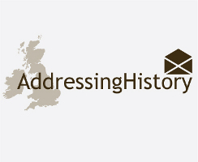

This repository contains the __Post Office Directory Parser (podparser)__, a Python package, created for and used in the [AddressingHistory](http://addressinghistory.edina.ac.uk) project. The podparser is a tool for parsing Scotland’s Post Office directories.

The [Scottish Post Office directories](http://www.nls.uk/family-history/directories/post-office) are annual directories, from the period 1773 to 1911, that include an alphabetical list of a town’s or county’s inhabitants. The directories have been digitised by the [National Library of Scotland](http://www.nls.uk) and made available in XML format. The podparser attempts to parse the XML and determine the forename, surname, occupation and address(es) of each entry. Furthermore, each address location is geocoded using the [Google Geocoding API](http://code.google.com/apis/maps/documentation/geocoding). Currently only the General Directory section of the directories are parsed by the podparser.

For full details of the podparser, including dependencies, installation and usage, please see the full podparser documentation hosted in the [Python Package Index](https://pythonhosted.org/podparser/). Support for the podparser is available through the GitHub issue tracker or by contacting the AddressingHistory project team via the EDINA helpdesk: edina@ed.ac.uk.

For more information on the AddressingHistory project please take a look at the project blog. To view and access Post Office Directory materials processed using the podparser please explore the [AddressingHistory website](http://addressinghistory.edina.ac.uk), for which an [API](http://addressinghistory.edina.ac.uk/api) is also available.

AddressingHistory was funded by [Jisc](http://www.jisc.ac.uk/) as part of their [Developing Community Content programme](http://www.jisc.ac.uk/whatwedo/programmes/digitisation/communitycontent.aspx) and is being run by [EDINA](http://edina.ac.uk), working in partnership with the [National Library of Scotland](http://www.nls.uk).